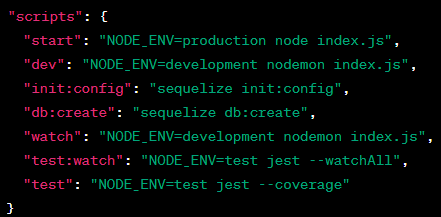
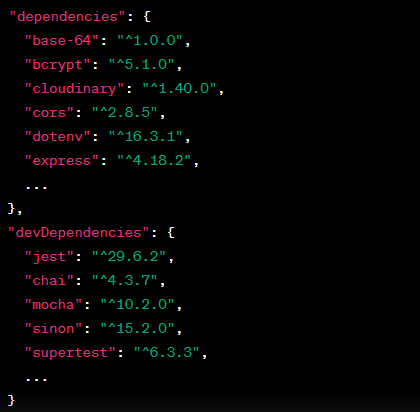

# Skillify Project

## Team members

- Rama Al-Momani  😊

- Laith Abdullah Saleem 😎
- Mohammed Abdeen 😁
- Alaa Nsairat 🤩
- Bashar Alirani 😈

# Description
In today's fast-paced world, the demand for skilled handymen is greater than ever, yet the process of finding trustworthy professionals can often be a daunting task. Introducing Skilify – a cutting-edge freelancing platform poised to redefine the way handymen and users connect and collaborate. Our innovative application is designed to seamlessly bridge the gap between those seeking top-tier handyman services and the talented experts ready to deliver exceptional results.

# Key Features:

- 🔍 Effortless Discovery: Discover a curated selection of skilled handymen profiles, each showcasing their expertise, work portfolio, and user ratings.

- 📅 Efficient Scheduling: Seamlessly schedule appointments with handymen based on your convenience and availability.

- 💌 Instant Communication: Enjoy real-time messaging capabilities, enabling direct and efficient communication with handymen to discuss project details.

- 💰 Secure Payments: Experience peace of mind with secure payment processing, ensuring a seamless and trustworthy transaction experience.

- 🌟 Transparent Reviews: Browse authentic user reviews and ratings to make informed decisions and select the perfect handyman for your needs.

- 🌐 User-friendly Interface: Navigate through our intuitive and user-friendly interface, making the process of finding and hiring handymen an enjoyable experience.

# Technologies Utilized:

- Backend: Node.js, Express
- Database: Postgres
- Authentication: JWT
- Payment Gateway: Stripe

# Usage:

- Register or log in to your Skilify account.

- Explore handymen profiles, reviews, and ratings to 
- identify the perfect fit for your project.

- Submit detailed service requests, outlining your specific requirements.
- Engage in real-time conversations with handymen to discuss project details and expectations.
- Make secure payments through our integrated payment gateway upon project completion.
- Contribute to the community by leaving authentic reviews and ratings based on your experience.

**Skilify is more than just a platform – it's a dynamic ecosystem that empowers both users and handymen to create exceptional outcomes. Experience the future of freelancing with Skilify today.**

# Backend Setup and Configuration

## Scripts
Simplify development tasks with these scripts:

- start: Launches the server in production mode.
- dev: Starts the server in development mode with auto-restart using nodemon.
- init:config: Sets up Sequelize configuration.
- db:create: Creates the database using Sequelize.
- watch: Shortcut for "dev," starts the server in development mode.
- test:watch: Runs tests in watch mode using Jest.
- test: Executes tests and generates coverage reports 

using Jest.
Example:

# Dependencies and Dev Dependencies

## Dependencies:
- base-64: Encode and decode base64 strings.
- bcrypt: Secure password hashing.
- cloudinary: Manage media with Cloudinary.
- cors: Handle Cross-Origin Resource Sharing.
- dotenv: Load environment variables.
- express: Build web APIs and apps. and more 

## Dev Dependencies:
- jest: Test your application.
- chai: Assertion library.
- mocha: Testing framework.
- sinon: Create spies, mocks, and stubs.
- supertest: Test HTTP requests.

# Features

## Feature: Task Management
### Overview
The Task Management feature enables users to create, view, update, and delete tasks. Tasks represent specific activities that need to be completed.

### Task Creation:

Users can create new tasks by providing details such as task title, description, location, and any other relevant information.
The tasks are associated with clients who need the work done.

### Task Assignment:

Created tasks can be assigned to specific handymen or companies for execution.
The assignment includes information about the assigned handyman or company and any specific instructions.

### Task Status:

Tasks can have different status indicators to track their progress, such as "Pending," "In Progress," and "Completed."
Users can update the status of tasks as they are being worked on and once they are finished.

### Task Retrieval:

Users can retrieve a list of all tasks, including their details and status.
Tasks can be filtered based on different criteria, such as task status, assigned handyman/company, and more.

### Task Details Update:

Users can update the details of a specific task, such as modifying the task description, location, or any other relevant information.

### Task Deletion:

Users have the option to delete tasks that are no longer needed or relevant.

### Notifications:

The system can send notifications to users when tasks are assigned, updated, or completed.

### Authentication and Authorization:

Access to task management functionalities is protected by user authentication and authorization mechanisms.
Only authorized users (clients, handymen, or companies) can create, update, and manage tasks.

### Error Handling:

Proper error handling is implemented to provide informative messages to users in case of any issues during task creation, assignment, or management.

### Data Relationships:

The Task Management feature may involve relationships between tasks, handymen, companies, and clients, depending on your specific application design.

### API Endpoints:

The feature is exposed through various API endpoints that handle different actions related to task management, such as task creation, assignment, retrieval, update, and deletion.

## API Endpoints

### Create a New Task
- **URL:** /tasks
- **Method:** POST
- **Description:** Create a new task.
- **Controller Function:** createTask

### Get Tasks for Handyman
- **URL:** /handytasks/:handymanId
- **Method:** GET
- **Description:** Retrieve tasks assigned to a specific handyman.
- **Controller Function:** getTasksForHandyman

### Get Tasks for Company
- **URL:** /companytasks/:companyId
- **Method:** GET
- **Description:** Retrieve tasks associated with a specific company.
- **Controller Function:** getTasksForCompany

### Get Tasks for Client
- **URL:** /clienttasks/:clientId
- **Method:** GET
- **Description:** Retrieve tasks associated with a specific client.
- **Controller Function:** getTasksForClient

### Update Task for Handyman
- **URL:** /taskshandy/:taskId
- **Method:** PATCH
- **Description:** Update task details for a handyman.
- **Controller Function:** updateTaskForHandyman

### Update Task for Company
- **URL:** /taskscompany/:taskId
- **Method:** PATCH
- **Description:** Update task details for a company.
- **Controller Function:** updateTaskForCompany

### Update Task for Client
- **URL:** /taskclient/:taskId
- **Method:** PATCH
- **Description:** Update task details for a client.
- **Controller Function:** updateTaskForClient

### Delete Task
- **URL:** /tasks/:taskId
- **Method:** DELETE
- **Description:** Delete a specific task.
- **Controller Function:** deleteTask

## Feature: User Authentication
### Overview
The User Authentication feature allows users, companies, and handymen to sign up, sign in, request password resets, and reset their passwords. It provides secure authentication and user management for the application.

**API Endpoints**
### Sign Up for Company

- **API Endpoint:** `POST /signupcompany`
- **Description:** Create a new company account.
- **Request Body Parameters:**
  - `username` (string, required): Username for the company.
  - `name` (string, required): Name of the company.
  - `password` (string, required): Password for the company account.
  - ... (other parameters)
- **Response:** The created company object.
- **Error Response:** HTTP 500 Internal Server Error if the creation fails.

### Sign Up for Handyman

- **API Endpoint:** `POST /signuphandyman`
- **Description:** Create a new handyman account.
- **Request Body Parameters:**
  - `username` (string, required): Username for the handyman.
  - `phoneNumber` (integer, required): Phone number of the handyman.
  - `firstName` (string, required): First name of the handyman.
  - ... (other parameters)
- **Response:** The created handyman object.
- **Error Response:** HTTP 500 Internal Server Error if the creation fails.

### Sign Up for User

- **API Endpoint:** `POST /signupuser`
- **Description:** Create a new user account.
- **Request Body Parameters:**
  - `username` (string, required): Username for the user.
  - `password` (string, required): Password for the user account.
  - `phoneNumber` (integer, required): Phone number of the user.
  - ... (other parameters)
- **Response:** The created user object.
- **Error Response:** HTTP 500 Internal Server Error if the creation fails.

### Sign In

- **API Endpoint:** `POST /signin`
- **Description:** Sign in with an existing user, company, or handyman account.
- **Request Headers:**
  - `Authorization` (string, required): Basic authentication token.
- **Response:** The user/company/handyman object based on the provided credentials.
- **Error Response:** HTTP 401 Unauthorized if the credentials are invalid.

### Forgot Password

- **API Endpoint:** `POST /forgot-password`
- **Description:** Request a password reset link via email.
- **Request Body Parameters:**
  - `email` (string, required): Email address of the user/company/handyman.
- **Response:** A message indicating that a password reset email has been sent.
- **Error Response:** HTTP 404 Not Found if the user/company/handyman does not exist.

### Reset Password

- **API Endpoint:** `POST /reset-password`
- **Description:** Reset the password using a valid reset token received via email.
- **Request Body Parameters:**
  - `token` (string, required): Password reset token received via email.
  - `newPassword` (string, required): New password for the user/company/handyman.
- **Response:** A message indicating that the password has been updated successfully.
- **Error Response:**
  - HTTP 400 Bad Request if the token is invalid or expired.
  - HTTP 404 Not Found if the user/company/handyman does not exist.
  - HTTP 500 Internal Server Error for other errors.

### Models
The User Authentication feature relies on three models: User, Company, and Handyman. Each model contains attributes like username, password, email, phone number, and more.

### Authentication and Security
Passwords are securely hashed using bcrypt before being stored in the database.
JWT tokens are generated for authentication and stored as virtual attributes in the models.
Basic authentication (/signin) is used to validate credentials and provide access tokens.
Password reset tokens are generated and sent via email for password recovery.

### Error Handling
Proper error handling and responses are implemented for different scenarios, such as incorrect credentials, invalid tokens, missing data, and server errors.

### Additional Notes
The API endpoints are secured using the provided authentication methods.
Remember to implement validation and sanitation of input data to prevent security vulnerabilities.

## Feature: Handyman Management
# Handyman Management

### Overview

The Handyman Management feature provides endpoints to manage handymen profiles and their related information.

## API Endpoints

### Get All Handymen

- **API Endpoint:** `GET /handymen`
- **Description:** Retrieve a list of all handymen profiles.
- **Response:** A JSON array containing all handymen profiles.
- **Error Response:** HTTP 500 Internal Server Error if there is an issue retrieving handymen.

### Get Handymen by Genre

- **API Endpoint:** `GET /handymen/genre/:genreId`
- **Description:** Retrieve handymen profiles by a specific genre ID.
- **Request Parameters:**
  - `genreId` (integer, required): ID of the genre.
- **Response:** A JSON array containing handymen profiles in the specified genre.
- **Error Response:** HTTP 500 Internal Server Error if there is an issue retrieving handymen.

### Get Handyman by ID

- **API Endpoint:** `GET /handymen/:id`
- **Description:** Retrieve a specific handyman profile by ID.
- **Request Parameters:**
  - `id` (integer, required): ID of the handyman.
- **Response:** A JSON object representing the handyman profile.
- **Error Response:**
  - HTTP 404 Not Found if the handyman is not found.
  - HTTP 500 Internal Server Error if there is an issue retrieving the handyman.

### Expertise and Genres

Handymen have associated expertise (genres) that define their skills. The following endpoints allow you to manage handymen's expertise:

#### Get Expertise List

- **API Endpoint:** `GET /expertise`
- **Description:** Retrieve a list of available expertise (genres).
- **Response:** A JSON array containing expertise (genres) available for handymen.

#### Get Expertise by Handyman ID

- **API Endpoint:** `GET /handymen/:id/expertise`
- **Description:** Retrieve expertise (genres) associated with a specific handyman by ID.
- **Request Parameters:**
  - `id` (integer, required): ID of the handyman.
- **Response:** A JSON array containing expertise (genres) associated with the handyman.
- **Error Response:**
  - HTTP 404 Not Found if the handyman is not found.
  - HTTP 500 Internal Server Error if there is an issue retrieving expertise.

#### Add Expertise to Handyman

- **API Endpoint:** `POST /handymen/:id/expertise`
- **Description:** Add expertise (genre) to a specific handyman by ID.
- **Request Parameters:**
  - `id` (integer, required): ID of the handyman.
- **Request Body Parameters:**
  - `genreId` (integer, required): ID of the expertise (genre) to be added.
- **Response:** A message indicating that the expertise has been added to the handyman.
- **Error Response:**
  - HTTP 404 Not Found if the handyman is not found.
  - HTTP 500 Internal Server Error if there is an issue adding expertise.

#### Remove Expertise from Handyman

- **API Endpoint:** `DELETE /handymen/:id/expertise/:genreId`
- **Description:** Remove expertise (genre) from a specific handyman by ID.
- **Request Parameters:**
  - `id` (integer, required): ID of the handyman.
  - `genreId` (integer, required): ID of the expertise (genre) to be removed.
- **Response:** A message indicating that the expertise has been removed from the handyman.
- **Error Response:**
  - HTTP 404 Not Found if the handyman or expertise is not found.
  - HTTP 500 Internal Server Error if there is an issue removing expertise.

### Authentication and Authorization

The Handyman Management feature includes authentication and authorization mechanisms. Users need to be authenticated to access certain endpoints, and access is controlled based on the user's role (handyman, user, etc.).

Authentication is implemented using JSON Web Tokens (JWT), and the following endpoints are relevant:

- `POST /signin`: Sign in with an existing user, company, or handyman account.
- `POST /forgot-password`: Request a password reset link via email.
- `POST /reset-password`: Reset the password using a valid reset token received via email.

### Error Handling

Proper error handling is implemented throughout the Handyman Management feature to provide informative error messages in case of any issues during profile retrieval, expertise management, or authentication.
## Feature: Payment Handling
### Overview
The Payment Handling feature allows users to make payments for various items and services using PayPal integration. It provides API endpoints to initiate and confirm payments through PayPal.

## API Endpoints

### Initiate Payment

- **API Endpoint:** `POST /pay`
- **Description:** Initiate a payment for a specific item or service using PayPal.
- **Request Body:** None
- **Response:** Redirects the user to the PayPal approval URL for payment confirmation.

### Confirm Payment

- **API Endpoint:** `GET /success`
- **Description:** Confirm and process the PayPal payment after user approval.
- **Request Parameters:** None
- **Response:** Displays a success message upon successful payment execution.

### Cancel Payment

- **API Endpoint:** `GET /cancel`
- **Description:** Handle payment cancellation.
- **Request Parameters:** None
- **Response:** Displays a cancellation message.

## PayPal Integration

This feature integrates with PayPal to facilitate secure payment transactions. The following steps outline the PayPal integration process:

1. **Configuration**: Configure PayPal credentials for sandbox or live mode, including the client ID and client secret.

2. **Initiate Payment**: When a user requests to make a payment, create a payment JSON object containing transaction details, such as item description, price, and currency. Use the PayPal REST API to create a payment.

3. **Redirect to PayPal**: Extract the PayPal approval URL from the payment response and redirect the user to this URL. The user will log in to their PayPal account and approve the payment.

4. **Confirm Payment**: After the user approves the payment on PayPal's website, PayPal redirects the user back to the `/success` endpoint of your application. Extract the `PayerID` and `paymentId` from the query parameters.

5. **Execute Payment**: Using the `PayerID` and `paymentId`, create an execute payment JSON object and use the PayPal REST API to execute the payment. Upon success, display a success message to the user.

## Feature: Messaging
This feature allows users to exchange messages and manage conversations between users and handymen.

## API Endpoints

### Fetch All Conversations for a Specific User

- **URL:** `/inboxes`
- **Method:** GET
- **Description:** Fetch all conversations for a specific user.
- **Authentication:** Requires bearer token.
- **Response:** List of conversations.

### Fetch Conversations for a User

- **URL:** `/conversations/:userId`
- **Method:** GET
- **Description:** Fetch conversations for a specific user.
- **Parameters:**
  - `userId` (integer, required): ID of the user.
  - `role` (string, required): Role of the user (handyman or user).
- **Authentication:** Requires bearer token.
- **Response:** List of conversations.

### Fetch All Messages for a Conversation

- **URL:** `/messages/:conversationId`
- **Method:** GET
- **Description:** Fetch all messages for a specific conversation.
- **Parameters:**
  - `conversationId` (integer, required): ID of the conversation.
- **Authentication:** Requires bearer token.
- **Response:** List of messages.

### Send a Message and Create a New Inbox

- **URL:** `/messages/:user1Id/:user2Id`
- **Method:** POST
- **Description:** Send a message and create a new inbox if needed.
- **Parameters:**
  - `user1Id` (integer, required): ID of the first user (sender or receiver).
  - `user2Id` (integer, required): ID of the second user (sender or receiver).
- **Query Parameters:**
  - `senderRole` (string, required): Role of the sender (handyman or user).
- **Request Body:**
  - `inboxId` (integer, optional): ID of an existing inbox (if applicable).
  - `userId` (integer, required): ID of the user sending the message.
  - `content` (string, required): Content of the message.
  - `sentAt` (string, required): Timestamp of when the message was sent.
- **Authentication:** Requires bearer token.
- **Response:** Created message.

## Database Models

### Inbox Model

Represents conversations between users and handymen.

- `lastMessage` (string): Last message content in the conversation.

### Inbox Participants Model

Defines the relationship between users and conversations.

### Message Model

Represents individual messages within a conversation.

- `messageContent` (string): Content of the message.
- `sentAt` (string): Timestamp of when the message was sent.
- `senderId` (integer): ID of the sender.

## Feature: Expertise Management
### Overview:
The Expertise Management feature enables efficient categorization and search for skilled professionals by providing endpoints to manage expertise categories and their associations with handymen and companies. This feature enhances the organization and skill-based searching capabilities within the application.

### Key Functionality:
- Creation of new expertise categories.
- Retrieval of all expertise categories.
- Retrieval of expertise category by ID.
- Retrieval of handymen and companies associated with a specific expertise.

## API Endpoints

### Create New Expertise

API Endpoint: `POST /experties`

Description: Create a new expertise category.

Request Body Parameters:
- `name` (string, required): Name of the expertise category.

Response: The created expertise object.

Error Response:
- HTTP 500 Internal Server Error if the creation fails.

---

### Get All Expertises

API Endpoint: `GET /experties`

Description: Retrieve a list of all expertise categories.

Response: A list of expertise categories.

Error Response:
- HTTP 500 Internal Server Error if the retrieval fails.

---

### Get Expertise by ID

API Endpoint: `GET /experties/:id`

Description: Retrieve an expertise category by its ID.

Response: The expertise category object.

Error Response:
- HTTP 404 Not Found if the expertise category does not exist.
- HTTP 500 Internal Server Error for other errors.

---

### Get Handymen and Companies by Expertise

API Endpoint: `GET /experties/all/:id`

Description: Retrieve all handymen and companies associated with a specific expertise.

Request Parameters:
- `id` (integer, required): ID of the expertise category.

Response: An object containing the expertise category and associated handymen and companies.

Error Response:
- HTTP 404 Not Found if the expertise category does not exist.
- HTTP 500 Internal Server Error for other errors.

### Models:
The Expertise Management feature includes the `Expertise` model, representing expertise categories. This model contains attributes like name and associations with handymen and companies.

### Associations:
- Many-to-Many relationship between Expertise and Handymen using the `expertise_handymen` table.
- Many-to-Many relationship between Expertise and Companies using the `expertise_company` table.

### Security Measures:
The expertise categories are securely managed within the system. Proper error handling and responses are implemented for various scenarios to ensure robustness and security.

### Use Cases:
- Companies can categorize their services and offerings for better user navigation.
- Handymen can associate themselves with specific expertise categories to enhance their visibility to potential clients.
- Users can easily search and filter professionals based on their expertise, facilitating efficient service selection.

## Feature: Dashboard
The Dashboard feature provides functionality for managing personal data for users, handymen, and companies. It includes endpoints for retrieving, updating, and deleting personal information.

## Authentication and Authorization

To access the Dashboard feature, users, handymen, or companies must be authenticated and authorized using tokens. Authentication is performed using JWT tokens, and endpoints are secured with middleware functions that verify the authenticity of the tokens.

## Endpoints

### Get Personal Data

Retrieve personal data for a user, handyman, or company.

API Endpoint: `GET /dashboard/personal-data`

Description: Retrieve personal data for a user, handyman, or company based on the provided query parameters.

Request Query Parameters:

- `role` (string, required): Role of the entity (user, handyman, company).
- `id` (integer, required): ID of the entity.

Response: Personal data object for the specified entity.

Error Response:

- HTTP 400 Bad Request if an invalid role parameter is provided.
- HTTP 404 Not Found if the entity does not exist.
- HTTP 500 Internal Server Error for other errors.

### Update Personal Data

Update personal data for a user, handyman, or company.

API Endpoint: `PATCH /dashboard/personal-data`

Description: Update personal data for a user, handyman, or company based on the provided query parameters and request body.

Request Query Parameters:

- `role` (string, required): Role of the entity (user, handyman, company).
- `id` (integer, required): ID of the entity.

Request Body: New data to update the entity's information.

Response: Updated personal data object for the specified entity.

Error Response:

- HTTP 400 Bad Request if an invalid role parameter is provided.
- HTTP 404 Not Found if the entity does not exist.
- HTTP 500 Internal Server Error for other errors.

### Delete Personal Data

Delete personal data for a user, handyman, or company.

API Endpoint: `DELETE /dashboard/personal-data`

Description: Delete personal data for a user, handyman, or company based on the provided query parameters.

Request Query Parameters:

- `role` (string, required): Role of the entity (user, handyman, company).
- `id` (integer, required): ID of the entity.

Response: A message indicating successful deletion.

Error Response:

- HTTP 400 Bad Request if an invalid role parameter is provided.
- HTTP 404 Not Found if the entity does not exist.
- HTTP 500 Internal Server Error for other errors.

## Models

The Dashboard feature interacts with the following models:

- `User`: Represents a user with attributes such as username, password, email, phone number, role, and more.
- `Handyman`: Represents a handyman with attributes such as username, password, email, phone number, role, years of experience, hourly rate, and more.
- `Company`: Represents a company with attributes such as username, password, email, phone number, role, number of employees, rating, and more.

## Authentication and Security

- Passwords for users, handymen, and companies are securely hashed using bcrypt before being stored in the database.
- JWT tokens are generated for authentication and stored as virtual attributes in the models.
- Endpoints are secured using middleware functions to ensure valid tokens are provided.

## Error Handling

Proper error handling and responses are implemented for different scenarios, such as invalid role parameters, entity not found, and server errors.

## Feature: Error Handling
- Middleware for handling 404 Not Found errors.
- Middleware for handling server errors.

# Socket.io Feature Documentation

## Introduction

The Socket.io feature in this application enables real-time, bidirectional communication between clients (users) and handymen. It utilizes the Socket.io library to establish a communication channel over WebSocket connections, allowing instant updates and interactions between different users of the platform.

## Key Components

1. **Socket.io Server Initialization:** The server-side module initializes the Socket.io server, handling user connections and events.

2. **Client Socket Initialization:** The client-side module establishes a Socket.io connection for clients (users), enabling them to interact with the server.

3. **Handyman Socket Initialization:** Similar to clients, the handyman-side module initializes a Socket.io connection for handymen to interact with the server.

4. **Event Handling Functions:** These functions handle various communication events, ensuring seamless interactions and real-time updates.

## Features

### Real-time Task Allocation

- The server receives task requests from clients and sends them to available handymen.
- Handymen receive notifications when new tasks are available.
- Clients receive notifications if their selected handyman is busy.

### Task Status Updates

- The server notifies clients and handymen about task status changes (e.g., task accepted, arrived at the location).
- Handymen can indicate their arrival at the client's location, and clients are informed about this.

### Payment and Scheduling

- Clients make payments for services.
- Handymen confirm payments and schedule task execution.
- Payment and scheduling updates are communicated to both clients and handymen.

### Task Details and Cost

- Handymen provide clients with estimated costs for services.
- Clients receive details about the task's estimated cost.
- Clients can choose to accept or reject the service based on the provided cost.

### Late Arrival Handling

- If a handyman arrives late, the client is informed and given the choice to continue or reject the service.
- Handymen receive updates about the client's choice and subsequent actions.

### Service Completion

- Handymen indicate the start of work after receiving payment.
- Payment and completion updates are shared between clients and handymen.
- Clients can review handymen's performance after task completion.

## Usage

1. **Socket.io Server Initialization:** This module initializes the Socket.io server, managing user connections and event handling.

2. **Client Socket Initialization:** The client-side module establishes a Socket.io connection for clients, allowing them to interact with the server and receive real-time updates.

3. **Handyman Socket Initialization:** Similar to clients, the handyman-side module initializes a Socket.io connection for handymen to interact with the server.

4. **Event Handling Functions:** These functions handle various events such as task allocation, payment confirmation, task status updates, and more.

## Benefits

- Seamless real-time communication between clients and handymen.
- Instant updates on task status, payment, and scheduling.
- Improved user experience with dynamic and interactive interactions.
- Efficient task allocation and tracking for both clients and handymen.

## Conclusion

The Socket.io feature provides a robust foundation for real-time communication between clients and handymen, enhancing the overall user experience and streamlining task management. By leveraging Socket.io, the application ensures prompt updates, interactive interactions, and effective task coordination.

# Unit Testing Feature Documentation

## Overview

The Unit Testing feature is an integral part of our application development process that ensures the reliability, functionality, and quality of our codebase. It involves automating the testing process to validate individual units of code, such as functions, methods, and modules, to ensure they produce the expected results.

## Purpose

The primary purpose of the Unit Testing feature is to identify and prevent defects early in the development lifecycle, thereby enhancing code stability and reducing the risk of regressions. By isolating and testing code units in isolation, we can catch bugs and issues before they impact other parts of the application.

## Key Benefits

- **Early Bug Detection:** Unit tests help catch bugs and issues during the development phase, reducing the cost and effort of fixing them later.
- **Code Confidence:** A comprehensive suite of unit tests provides confidence that code changes won't inadvertently break existing functionality.
- **Documentation:** Test cases serve as living documentation that illustrates how different parts of the code should behave.
- **Refactoring Safety:** Unit tests make it safer to refactor code, knowing that if tests pass, the expected behavior is maintained.

## Testing Framework

Our Unit Testing feature is supported by a testing framework that provides tools and utilities for creating, organizing, and running tests. We have chosen [Testing Framework Name] for this purpose.

## Test Suite Structure

Test suites are organized collections of test cases. Our test suite structure includes:

- **[Test Suite Name]:** Description of the tested functionality or module.
  - **Test Case 1:** Description of the specific behavior being tested.
  - **Test Case 2:** Description of another behavior being tested.
  - ...

## Writing Test Cases

Test cases are written to cover various scenarios and behaviors. A typical test case includes:

- **Description:** A clear and concise description of what behavior the test case is targeting.
- **Setup:** Any necessary setup or data preparation for the test.
- **Execution:** Executing the code unit being tested.
- **Assertion:** Checking the actual output against the expected output.
## Conclusion

The Unit Testing feature plays a crucial role in maintaining the quality, reliability, and functionality of our application's codebase. By identifying issues early and providing a safety net for code changes, we ensure a smooth development process and a high-quality end product.

