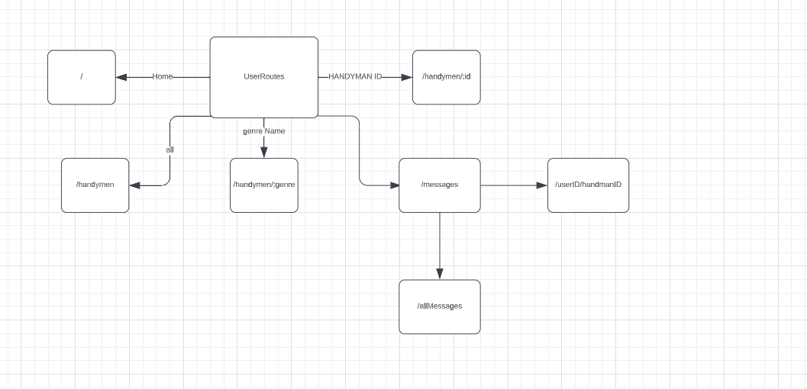
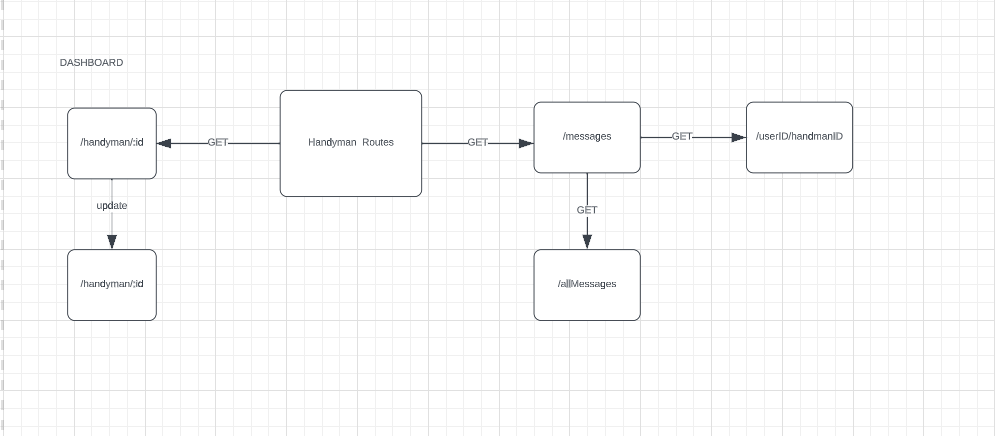

# Project Title

## Team members 
- Rama Al-Momani  😊

- Laith Abdullah Saleem 😎
- Mohammed Abdeen 😁
- Alaa Nsirat 🤩
- Bashar folan 😈 
🤔
## Description

when the project is chosen

## UML digram

## Table of Contents

- [Features](#features)
- [Installation](#installation)
- [Usage](#usage)
- [API Documentation](#api-documentation)
- [Configuration](#configuration)
- [Contributing](#contributing)
- [License](#license)

## Features

**Dashboard** 
1. For handymen so they can manage their profile 
2. see their monthly income 
3. see requests from customers.
4. ability to upload video and images.
5. Search client history and credibility.

**For users and visitors**
1. users and visitors can search for handy men based on their problem domain.
2. filtering handymen based on price and rating.
3. the ability to  sign up and signin as a freelancer or as a normal user or as a vistor.
4. For users that authinticate using phone number or email they get extra credibility.

**Joint**

4. users and handmen can chat with each other to agree on specific details.
**payment and transactions**
1. all payment details are handled in the application using stripe.
**API**
1.  Email Notifications
2. Error Handling and Logging
3. Third-Party Integrations we can use third party API to support chatting or payment.
4. Security Measures encryption using bycrypt and base-64 

## Installation

npm i to install dependencies.

## Usage

input to the crud operation and the output 

## API Documentation

[If your backend project offers an API, provide a link to its detailed documentation here.] not yet

## Configuration

[If your backend project requires any configuration or environment setup, describe it here.]

## Contributing

We will work togather using github be sure to pull from main when you start working and to push your branch when you finish.
Never push to the main

## License

[Specify the license under which your project is distributed. For example:]

This project is open-source and available under the [MIT License](LICENSE).
