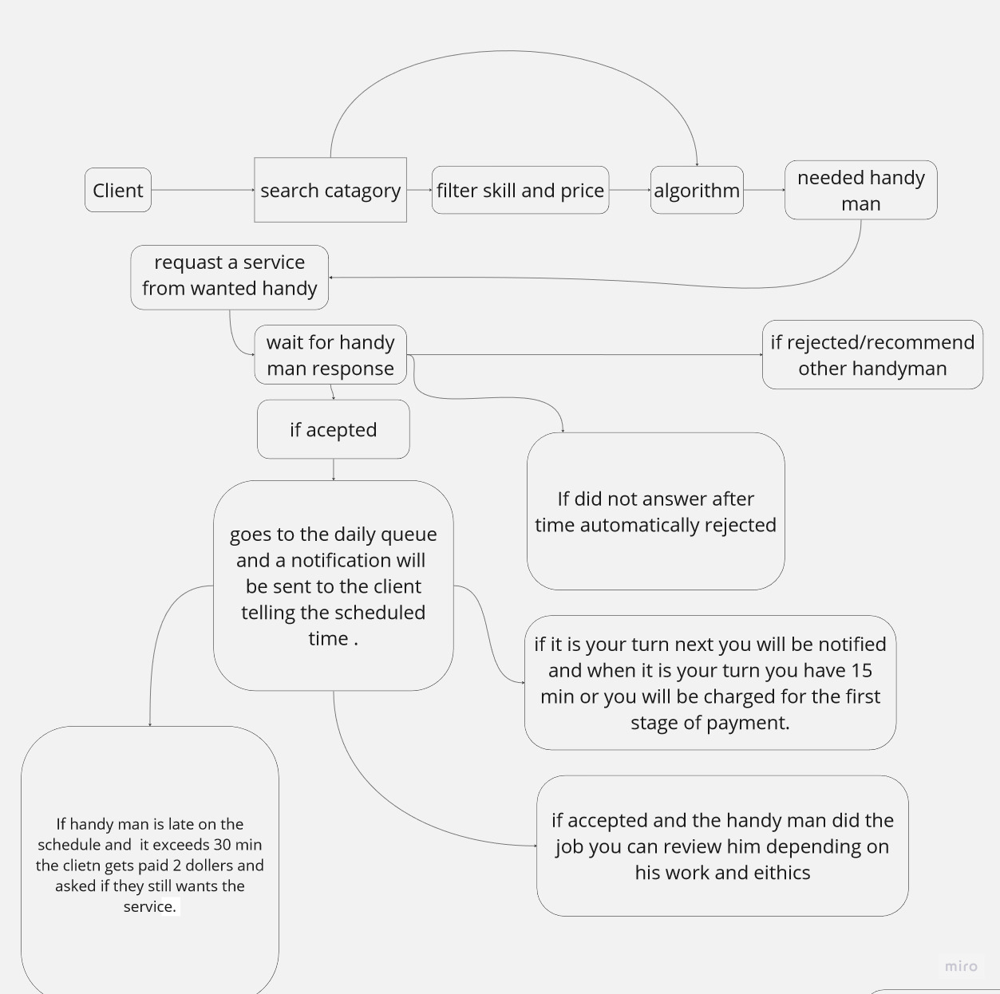
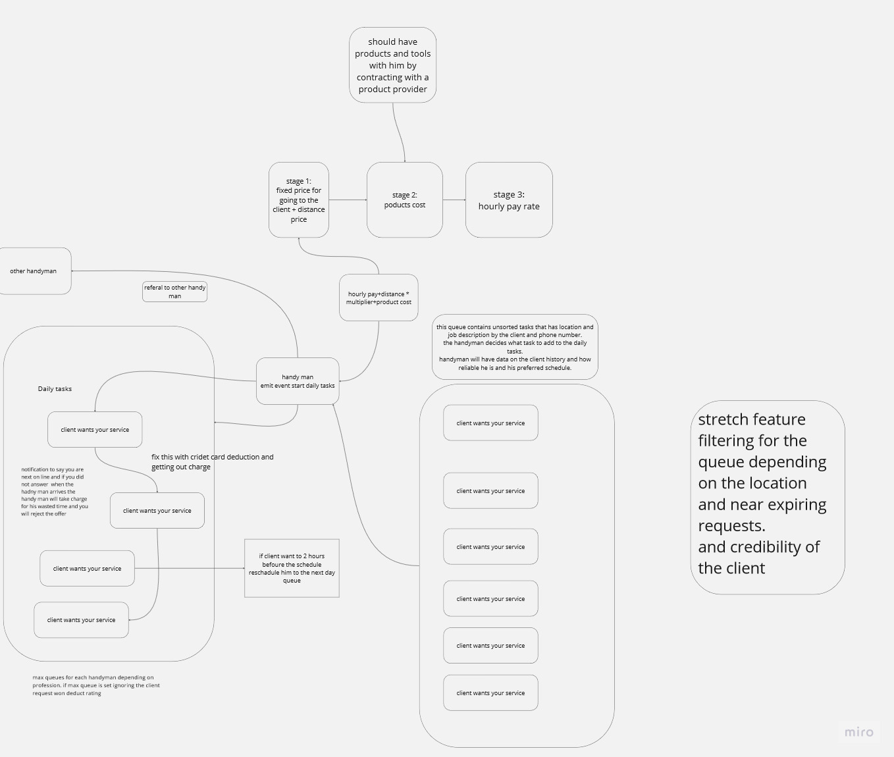

# HandyMan Event Flowchart

# Client Events Workflow

# Handyman EventWorkFlow

# STORIES FOR EVENT DRIVEN

# User Story 1

## As a Client, I want to request information about a Handyman's rating, number of previous customers, and price before requesting their service, so I can make an informed decision.
 
# User Story 2

## As a Client, I want to request a service from a Handyman, providing details like my location, problem description, picture, phone number, and credibility, along with the desired completion time, so that the Handyman can review and accept my request
 
# User Story 3

## As a Handyman, I want to review the service requests from Clients and choose a client I want to serve. Once selected, I will set a schedule and estimate the time needed to finish the task, sending the details to the daily tasks list
 
# User Story 4

## As a Client, I want to be notified once a Handyman accepts my service request. I also want to be informed about the scheduled time and receive a notification when the service is accepted, along with the deduction of money from my wallet for the first stage expenses.

# User Story 5

## As a Handyman, upon arrival at the job location, I will assess the problem and provide the cost of stage 2 and stage 3 payments to the Client.
 
# User Story 6

## As a Client, if I agree with the cost provided by the Handyman for stage 2 and 3, I will pay for the services.
 
# User Story 7

## As a Handyman, I will proceed to do the job after receiving the payment for stage 1 and any additional payments required.

# User Story 8

## As a Client, after the completion of the job, I will review the Handyman and provide feedback based on the service received.
# 
# User Story 9

## As a Handyman, if a Client declines the service request, I will receive payment only for stage 1 and then proceed to the next client.
 
# User Story 10

## As a Client, if a Handyman is late for the service by more than 30 minutes, I will receive a refund along with an additional $2 compensation. Alternatively, I can choose to proceed with the service and still receive $2 compensation.
 
# User Story 11

## As a Handyman, if I am late for the service by more than 30 minutes, I will automatically refund the stage 1 payment along with $2 as an apology.
 
# User Story 12

# As a Handyman, if I reject a service request from a Client, I will recommend other available Handymen and send an apology for being busy.
 
# User Story 13

## As a Handyman, if a service request expires, I will automatically reject it and send an apology to the Client for being busy.
 
# User Story 14

## As a Handyman, if the queue is at its maximum capacity and I am too busy, I will pick a new client and inform them that the queue is full, encouraging them to try again later.

# User Story 15

## As a Client, I can request to reschedule the service without incurring stage 1 expenses if I do it at least 2 hours in advance.
 
# User Story 16

## As a Handyman, if a Client requests a reschedule during the 2-hour window, the Client will be charged with stage 1 expenses again, and their service will be moved to the next day's queue.
 
# User Story 17

## As a Handyman, I will update the schedule of the Client to the next day if they request a reschedule within the 2-hour window. I will also send a notification to the Client with the updated schedule

## Stories For SignIn & SignUp

1. As a user ,I will signup and expect to have an account and  to  be logged in after that
2. as a user ,I will signin and expect to stay logged in after that till the token expires
3. as a company ,I will register and add my employees and expect to have the ability to manage them .
4. as a freelancer ,I expect to register and have the ability to control  my tasks  
5. as a freelancer ,I expect to have the ability to change my hourly payment 
6. as  a user ,I expect to have the ability to search for certain handymen genres and be able to book one of them 